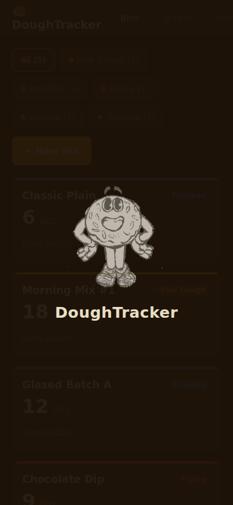
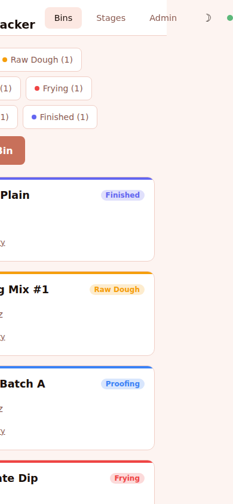
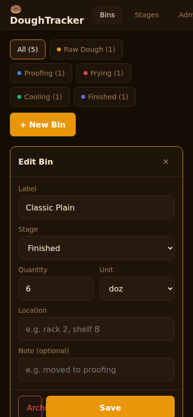
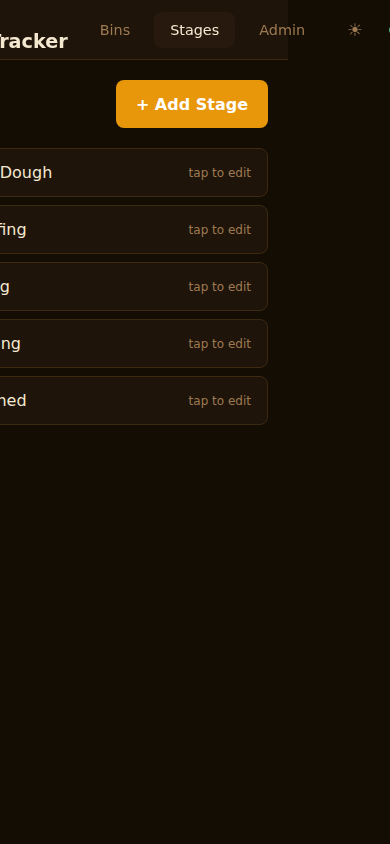
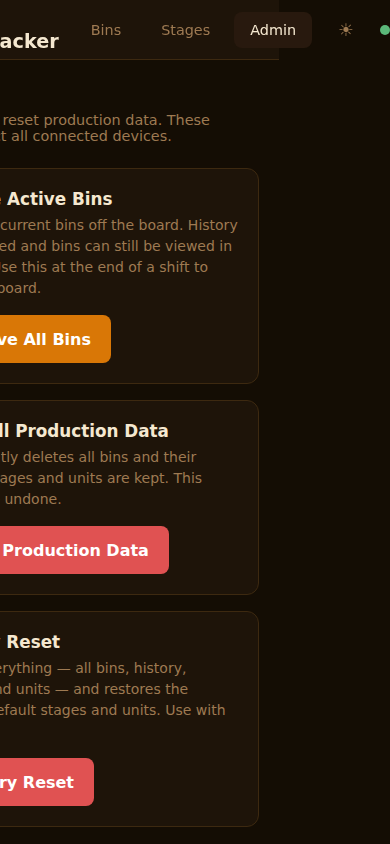

# DoughTracker

Real-time donut shop production management. Track dough bins through production stages across multiple tablets and phones on your local network.

| Dark Mode | Light Mode |
|---|---|
|  |  |

## Features

- **Live bin tracking** — create, edit, and archive dough bins with stage and quantity
- **Real-time sync** — all connected devices update instantly via Socket.io
- **Stage configuration** — fully customizable production stages with color labels
- **Admin panel** — archive all bins, clear production data, or factory reset
- **Bin history** — append-only audit log of every stage and quantity change
- **Light / dark mode** — warm espresso dark theme + blush pink light theme, persisted to localStorage
- **Google Sheets sync** — optional async mirror of bin data to a Google Sheet
- **Mobile-first** — touch-friendly UI designed for tablets and phones

## Screenshots

### Bin Edit


### Stage Configuration


### Admin Panel


## Quick Start (Development)

```bash
# Server
cd server && npm install && npm run dev

# Client (separate terminal)
cd client && npm install && npm run dev
```

Open `http://localhost:5173` in your browser.

## Production Deploy (Podman / Docker Compose)

```bash
mkdir -p data
podman-compose up --build -d
```

Client is served on port `9000`, server API on `3001`.

## Google Sheets Sync (Optional)

Bin data syncs to a Google Sheet every 30 seconds when configured.

**Setup:**
1. Go to [Google Cloud Console](https://console.cloud.google.com) under a personal Gmail account (org accounts may block service account key creation)
2. Create a project → enable the **Google Sheets API**
3. **IAM & Admin → Service Accounts** → create a service account → **Keys** tab → **Add Key → JSON** → download
4. Copy the JSON key to `data/service-account.json`
5. Share your Google Sheet with the `client_email` from the JSON (Editor access)
6. Set `GOOGLE_SPREADSHEET_ID` in your environment or a `.env` file next to `compose.yaml`

The app auto-creates tabs (`bins`, `stages`, `units`, `orders`) and writes headers on first connect. If Sheets sync isn't configured the app works fully without it.

**Environment variables:**

| Variable | Default | Purpose |
|---|---|---|
| `GOOGLE_SPREADSHEET_ID` | _(unset)_ | Enables Sheets sync when set |
| `GOOGLE_SERVICE_ACCOUNT_PATH` | `/data/service-account.json` | Path to service account JSON |
| `SHEETS_SYNC_INTERVAL_SECONDS` | `30` | Sync frequency |

## Environment Variables (server)

| Variable | Default | Purpose |
|---|---|---|
| `PORT` | `3001` | Server listen port |
| `DB_PATH` | `../doughtracker.sqlite` | SQLite file path |

## Data

SQLite database at `data/doughtracker.sqlite`. Back it up with:

```bash
cp data/doughtracker.sqlite data/doughtracker.sqlite.bak
```

Bins are soft-deleted (archived), never hard-deleted. `bin_history` is append-only.

## Default Stages

Seeded on first run (all editable in the Stages tab):
- Raw Dough → Proofing → Frying → Cooling → Finished

## Running Tests

Playwright E2E tests live in `tests/`. They target a running instance (configured to `http://192.168.68.120:9000` by default — update `baseURL` in the config files to match your deployment).

```bash
cd tests && npm install

# Desktop
npx playwright test

# Mobile (390x844, touch, iPhone UA)
npx playwright test --config playwright.mobile.config.js

# Regenerate README screenshots
npx playwright test specs/screenshots.spec.js --config playwright.mobile.config.js
```

Tests cover: dashboard, bin CRUD, history, stage management, admin panel, and Google Sheets sync verification.
